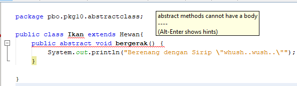

#### Nama	: Vega Anggaresta
#### NIM    : 2041723013
#### Kelas	: TI-2C

## Laporan Pertemuan 10

A. Praktikum

B. Diskusi
> Bolehkah apabila sebuah class yang meng-extend suatu abstract class tidak mengimplementasikan method abstract yang ada di class induknya? Buktikan!
* Tidak boleh, karena method pada indukclass sudah didelkarasikan, sehingga class child harus mengikuti mtehod yang ada di indukclass, jika tidak akan mengakibatkan program error
* Bukti

C. Pertanyaan
> 1. Berikan penjelasan terkait tentang jalannya program diatas
* Program diatas memiliki 5 class, yaitu hewan yang merupakan abstract class dan parentclass, class ikan dan kucing yang merupakan child class, class Orang, dan main class. perlu diketahui, pada parent class terdapat pendeklarasian method, sehingga pada child class harus juga memakai method yang sama. sedangkan pada main class terdapat 4 objek, 1 ikan, 1 kucing, 2 orang.

> 2. Tunjukkan hasil kompilasi program dan berikan penjelasan singkat jika method bergerak() diubah menjadi method abstract!
* Pada class hewan method bergerak sudah menjadi method abstract
* Apablia method bergerak pada class ikan dan kucing juga dirubah menjadi method abstract, akan mengakibatkan error. Hal ini terjadi karena method abstract tidak dapat meimiliki body

> 3.Tunjukkan hasil kompilasi program dan berikan penjelasan singkat jika tidak dilakukan overriding terhadap method bergerak() !

* Masih tetap bisa berjalan, karena method di class Hewan hanya pendeklarasian saja 

> 4. Tunjukkan hasil kompilasi program dan berikan penjelasan singkat jika tidak dilakukan overriding terhadap method bergerak()

* 
> 5. Tunjukkan hasil kompilasi program dan berikan penjelasan singkat jika abstract method bergerak()yang dideklarasikan dalam Class Ikan
* Apablia method bergerak pada class ikan dan kucing juga dirubah menjadi method abstract, akan mengakibatkan error. Hal ini terjadi karena method abstract tidak dapat meimiliki body

