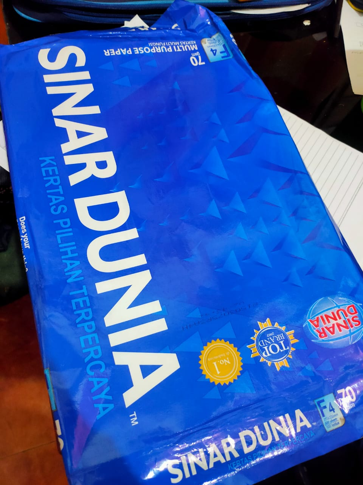
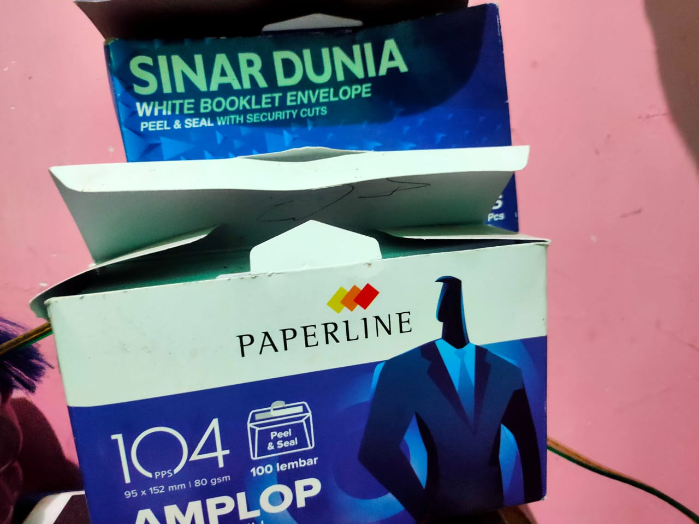
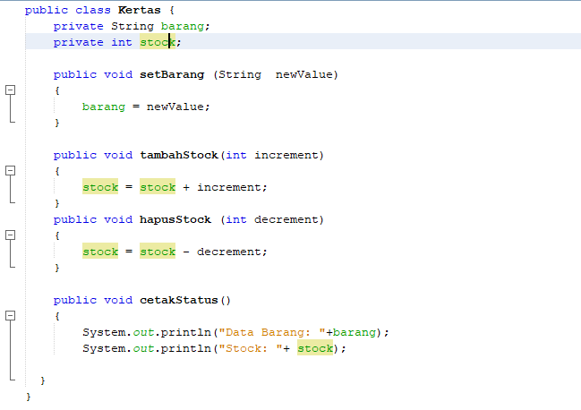
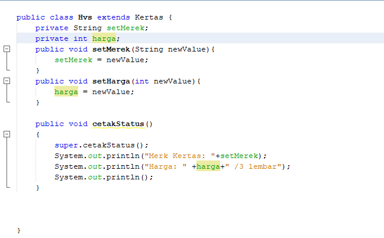
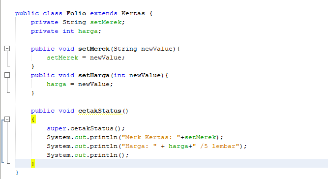

# Praktikum-PBO 1
#### Nama	: Vega Anggaresta
#### NIM		: 2041723013
#### Kelas	: TI-2C

## output program

Hasil dari identifikasi benda yang dapat saya temukan di sekitar saya untuk dilaporkan sebagai tugas praktikum adalah
1. Kertas HVS

2. Kertas Folio

3. Amplop

4. Pensil

## Penjelasan pada program
1. Kertas.java

Pada class ini method akan diwariskan ke kelas yang lain, yaitu kelas hvs dan folio
disini terdapat 2 atribut, yaitu barang dengan tipe data string dan stock bertipe data integer. Selanjutnya kita membuat method yang berfungsi untuk memberi nama barang, menambah stock, menghapus stock, serta mencetak informasi
2. HVS.java

Pada program ini mewarisi dari class kertas
jadi method-method yang terdapat pada class kertas tidak perlu kita tambahkan pada class ini lagi. Pada class hvs, terdapat 2 atribut yang akan kita tambahkan yaitu setMerk dan harga. kedua atribut tersebut kita buat sebagai method agar bisa memasukkan data. lalu tambahkan method cetak agar bisa menampilkan informasi. fungsi dari super adalah menampilkan data yang diambil dari class kertas sebelumnya.
3. Folio.java

Sama halnya dengan sebelumnya, Pada program ini mewarisi dari class kertas sehingga method-method yang terdapat pada class kertas tidak perlu kita tambahkan pada class ini lagi. Pada class hvs, terdapat 2 atribut yang akan kita tambahkan yaitu setMerk dan harga. kedua atribut tersebut kita buat sebagai method agar bisa memasukkan data. lalu tambahkan method cetak agar bisa menampilkan informasi. fungsi dari super adalah menampilkan data yang diambil dari class kertas sebelumnya.
4. Amplop.java

Sedangkan pada class ini, terdapat 4 atribut yaitu tipe dan merek bertipe data string, stock dan harga bertipe data integer. terdapat 6 buah method yang mana, setBarang berfungsi untuk memberi nama barang, setMerek berfungsi memberi merek, tambahStock berfungsi menambahkan jumlah, hapus stock berfungsi mengurangi jumlah, setHarga menambahkan informasi harga, serta method cetakStatus berfungsi menampilkan informasi dari data yang telah kita isikan.
5. Pensil.java

Sedangkan pada class ini, terdapat 4 atribut yaitu tipe dan merek bertipe data string, stock dan harga bertipe data integer. terdapat 6 buah method yang mana, setBarang berfungsi untuk memberi nama barang, setMerek berfungsi memberi merek, tambahStock berfungsi menambahkan jumlah, hapus stock berfungsi mengurangi jumlah, setHarga menambahkan informasi harga, serta method cetakStatus berfungsi menampilkan informasi dari data yang telah kita isikan.
6. Penjualan.java

Pada class ini terdapat 4 object yaitu, hvs dengan nama data1 yang mereferensi dari class hvs, folio dengan nama data2 dari class folio, amplop dengan nama data3 dari class amplop, dan pensil dengan nama data4 dari class pensil.
lalu untuk menambahkan informasi untuk data object tersebut, gunakan nama_dari_object.nama_method("gunakan petik jika data bertipe string")

