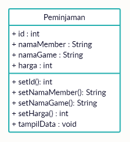
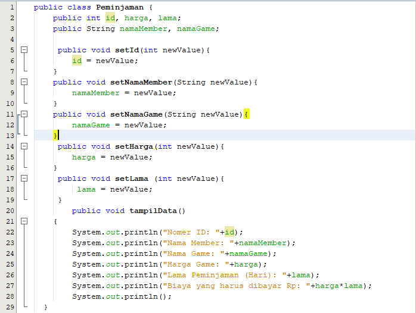
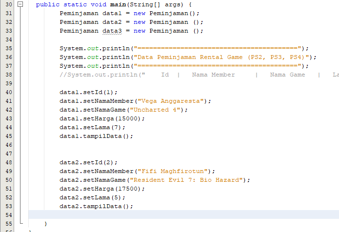
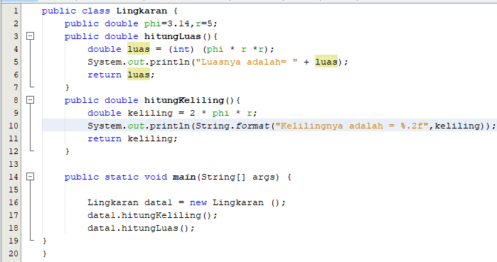
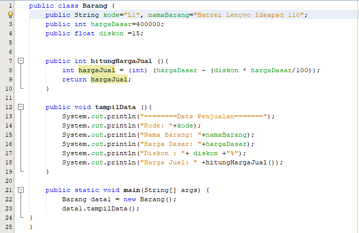

# Praktikum-PBO 1
#### Nama	: Vega Anggaresta
#### NIM    : 2041723013
#### Kelas	: TI-2C

## Jawaban No 1.

Penjelasan:
Atribut bernama id bertipe data int, atribut bernama namaMember, namaGame bertipe data String
lalu terdapat method setId() bertipe integer berfungsi untuk mengisi data Id. method setNamaMember() bertipe string berfungsi mengisi data nama member. method namaGame() bertipe string mengisi nama game. serta method tampilData() untuk menampilkan keseluruhan data

## Jawaban No 2.

Penjelasan:
Pengimplementasian dari Class Diagram No. 1 Ke Program Java.

Hasil Run:

## Jawaban No 3.

Penjelasan:
Pada Class Diagram Lingkaran di Soal No. 3
terdapat vaariabel phi dan r yang bertipe data double saya inisialisasikan langsung.
lalu terdapat method hitungLuas yang bertipe data double berisikan rumus untuk menghitung luas lingkaran serta menampilkan hasilnya.
Sedangkan pada method hitungKeliling bertipe data kan double dan berisikan rumus untuk menghitung keliling lingkaran serta menampilkan hasilnya.
lalu Main saya jadikan satu di class Linkaran. setelah itu membuat Object Lingkaran dengan nama data1, dan memanggil method hitungLuas dan hitungLingkaran

Hasil Run:

## Jawaban No. 4

Penjelasan:
Pada Class Diagram Barang, membuat suatu class Barang yang terdapat atribut kode, namaBarang bertipe data String, atribut hargaDasar bertipe data integer, dan diskon bertipe data float. Lalu membuat 2 method, method hitungHargaJual() yang berfungsi untuk menghitung hargaJual = (hargaDasar -(diskon * hargaDasar/100)). Serta method tampilData() yang ebrfungsi untuk menampilkan seluruh informasi.

hasil run:

