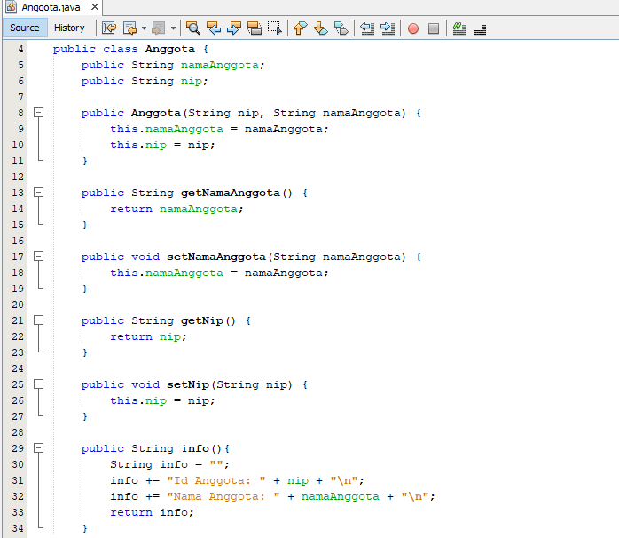
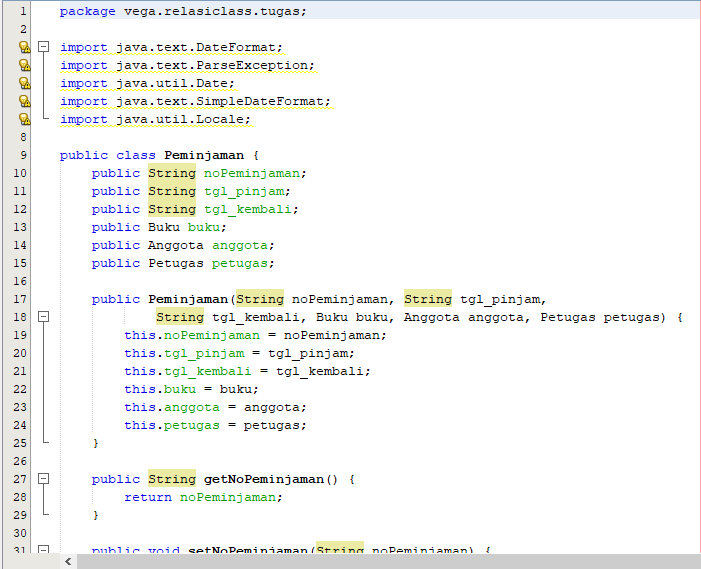
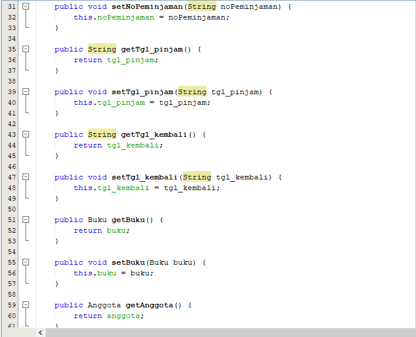
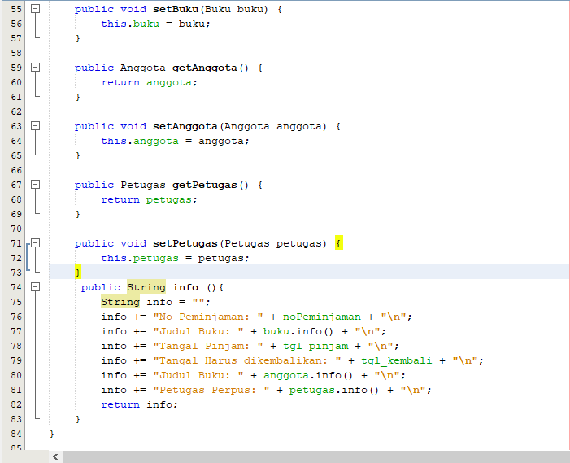
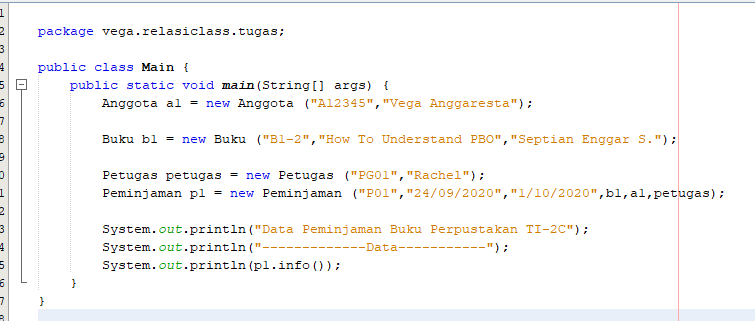
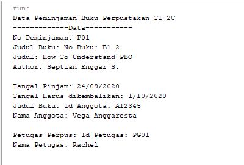

#### Nama	: Vega Anggaresta
#### NIM    : 2041723013
#### Kelas	: TI-2C

## Laporan Tugas Praktikum Pertemuan-4
Studi Kasus yang diambil adalah: Peminjaman Buku di Perpustakaan

terdapat 5 class:
1. Class Petugas
* Pada kelas ini terdapat 2 atribut yaitu, id (string) dan Nama Petugas (string)
* Lalu terdapat getter setter, constructor, dan method info() untuk menampilkan informasi.

2. Class Buku
* Pada kelas ini terdapat 3 atribut yaitu, no buku (string), Judul Buku (string), dan author (string)

3. Class Anggota
* Pada kelas ini hanya terdapat 2 Atribut saja yaitu, nip (String) dan nama Anggota (string)

4. Class Peminjaman
* Pada kelas ini terdapat atribut noPeminjaman (String), tgl_pinjam, tgl_kembali, Buku (Mengambil data dari kelas buku), Anggota (Memanggil data dari kelas Anggota), Petugas (Memanggil data dari kelas Petugas)

5. Class Main
* Membuat sebuah objek baru Anggota, buku, petugas
* Mengisi objek menggunakan konstruktor

* Hasil 

