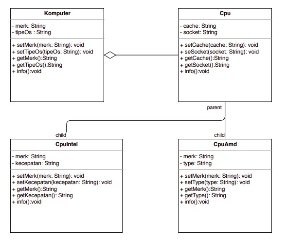

# Jawaban Teori-2
#### Nama	: Vega Anggaresta
#### NIM    : 2041723013
#### Kelas	: TI-2C

## Tugas Teori Pertemuan-4
Jumlah kelas terdapat 4:
Komputer, Cpu, CpuIntel, CpuAmd
Dengan Relasi
* Komputer Aggregated dengan CPU
* Sedangkan CPU memilliki anak CpuIntel dan CpuAMD
* Atribut kelas Komupter: Merk & tipe OS
* Atribut kelas CPU : Cache & Socket
* Atribut kelas CpuIntel : Merk, kecepatan
* Atribut kelas CpuAMD : Merk dan type 

