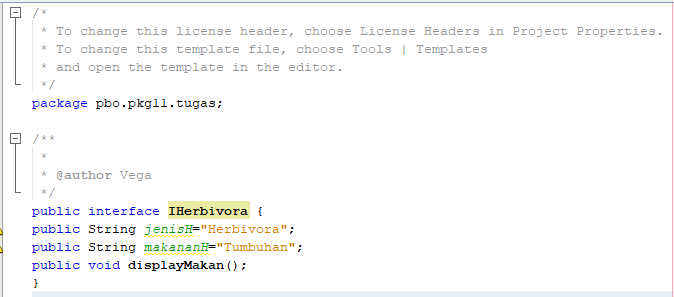
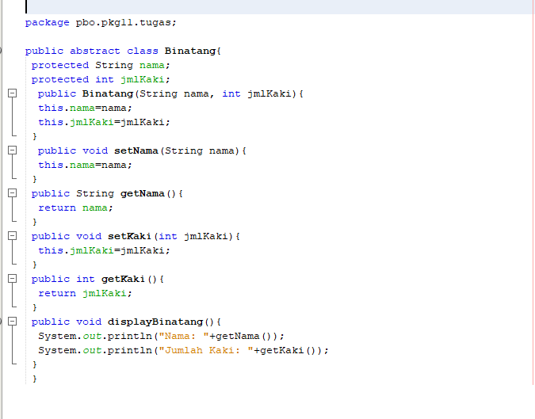
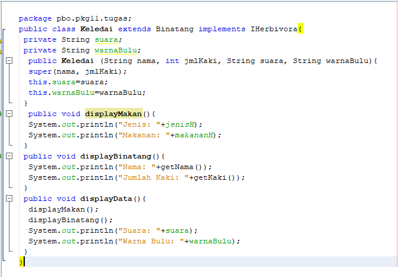

#### Nama	: Vega Anggaresta
#### NIM    : 2041723013
#### Kelas	: TI-2C

## Laporan Pertemuan 11

C. Praktikum Single Interface

D. Pertanyaan Praktikum Single Interface
1. Pada langkah ke 9, pada baris program ke 3 terdapat warning pada script tersebut. Jelaskan penyebab terjadinya hal tersebut? 
> Jawab: Penyebabnya karena class interface ICumlaude yang berada pada satu package
2. Pada langkah ke 9, pada baris program ke 3. Apa yang terjadi jika script tersebut dihilangkan? Jelaskan menurut pemahaman anda. 
> Jawab: karena baris kode yang dihilangkan adalah kode program yang tidak terpakai jadi walaupun di hapus tidak akan mengefek pada sistem program.
3. Mengapa pada langkah nomor 9 terjadi error? Jelaskan!
> Jawab: Karena dari class mahasiswa belum melakukan implements ke class interface ICumlaude
4. Dapatkah method kuliahDiKampus() dipanggil dari objek sarjanaCumlaude di class Program? Mengapa demikian?
> Jawab: Bisa, karana objek sarjanaCumlaude dari class Sarjana telah di-extends pada class Mahasiswa

5. Dapatkah method kuliahDiKampus() dipanggil dari parameter mahasiswa di method beriSertifikatCumlaude() pada class Rektor? Mengapa demikian?
> Jawab: Tidak bisa (mengalami error), hal ini karena class rektor dan class Mahsiswa tidak berkesinambungan.

6. Modifikasilah method beriSertifikatCumlaude() pada class Rektor agar hasil eksekusi
> Jawab:

E. Praktikum Percobaan Multiple interface

F. Pertanyaan Praktikum Multiple Interface
1. Pada script code interface IBerprestasi, modifikasi script tersebut sesuai dengan gambar 
Dari perubahan script diatas, apa yang terjadi ? serta jelaskan alasannya (capture hasilnya)
> Jawab: Terjadi eror, karena aturan penulisan interface modifier method yang digunakan adalah public

2. Perhatikan script code, Jelaskan menurut anda, mengapa hasil dari script code tersebut error?
> Jawab: Hal itu karena IBerprestasi merupakan class interface, dan class interface tidak dapat dibuat objek.

3. Apabila Sarjana Berprestasi harus menjuarai kompetisi NASIONAL dan
menerbitkan artikel di jurnal NASIONAL, maka modifikasilah class-class yang terkait
pada aplikasi Anda agar di class Program objek pakRektor dapat memberikan sertifikat
mawapres pada objek sarjanaCumlaude.
> Jawab: 

F. Tugas
* Terdapat sebuah UML diagram dari sistem yang mengidentifikasi tentang karakteristik dan jenis makanan dari beberapa binatang, seperti gambar
dibawah ini. Singa hanya makan jenis daging yang tergolong sebagai jenis Karnivora, sedangkan Keledai termasuk binatang Herbivora karena hanya
mengkonsumsi jenis tumbuhan. Sedangkan untuk Gorilla dapat mengkonsumsi makanan dari kedua jenis tersebut, dapat disebut dengan omnivora dan
dapat dikategorikan sebagai kombinasi dari Herbivora dan Karnivora. Dalam UML tersebut, juga terdapat beberapa karakteristik dari binatang
seperti nama, suara, warnabulu dan jumlah kaki.
> Jawab:
1. Class Interface Herbivora

>Pada class ini terdapat method public abstract void displayMakan(), yang akan digunakan sebagai implements untuk class Singa dan Gorilla.
2. Class Interface Karnivora

> Sama halnya dengan class interface Herbivora, Pada class karnivora juga terdapat method public abstract void displayMakan() yang akan digunakan sebagai implements untuk class Keledai dan Gorilla.
3. Parent Class Binatang

> Class ini merupakan parent class atau superClass dari class Singa, Gorilla dan Keledai, sedangkan atributnya dan method sesuai dengan class diagram yang diberikan.
4. Subclass Keledai

> Class ini merupakan turunan dari classParentnya yaitu class Binatang. Pada class ini juga terdapat implements dari class Interface herbivora. sedangkan atributnya dan method sesuai dengan class diagram yang diberikan.
5. Subclass Singa

> Sama seperti sebelemunya Class ini merupakan turunan dari classParentnya yaitu class Binatang. Pada class ini juga terdapat implements dari class Interface karnivora. sedangkan atributnya dan method sesuai dengan class diagram yang diberikan.
6. Subclass Gorilla

> Sama dengan sebelumnya Class ini merupakan turunan dari classParentnya yaitu class Binatang. Pada class ini juga terdapat 2 implements dari class Interface herbivora dan karnivora. sedangkan atributnya dan method sesuai dengan class diagram yang diberikan.

> Class Diagaram